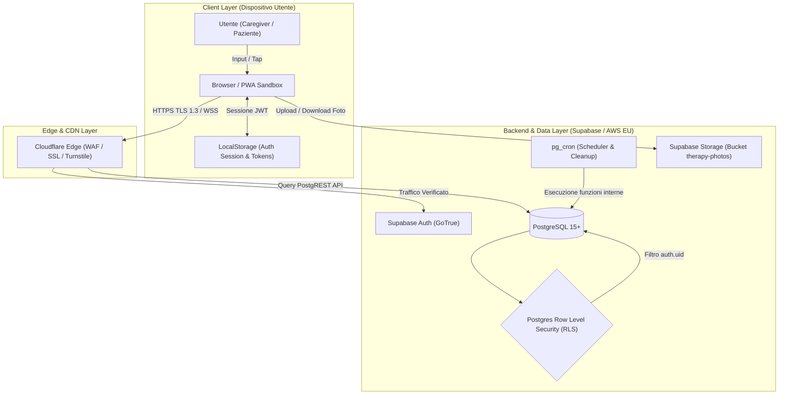

# Mappa dei Flussi di Dati (Data Flow Diagrams)
**Progetto:** FamilyMed  
**Riferimento normativo:** Artt. 24, 25 (Privacy by Design), 32 (Sicurezza) GDPR  
**Data ultimo aggiornamento:** 14 Settembre 2026  
**Stato:** Documentazione tecnica di audit interno  

---

## 1. Architettura Generale del Flusso Dati

L'architettura di FamilyMed è strutturata su un modello **Zero-Trust Client-to-Database**, in cui la sicurezza e la segregazione dei dati non sono delegate unicamente al server applicativo, ma sono garantite a livello di kernel del database PostgreSQL tramite **Row Level Security (RLS)** e token JWT crittografici.



---

## 2. Mappatura Dettagliata dei Singoli Flussi

### Flusso 1: Registrazione Utente & Raccolta Consensi

```
UTENTE
  ↓ [Nome, Email, Password, Ruolo, Flag Consensi]
Browser / PWA (Form Registrazione)
  ↓ [Verifica interazione umana]
Cloudflare Turnstile (Captcha senza tracciamento)
  ↓ Token Turnstile + Payload HTTPS
Supabase Auth (signUpUser)
  ↓ Crea record con password hashata (bcrypt)
auth.users
  ↓ Trigger DB automatico (on_auth_user_created)
public.profiles + public.user_roles (Role: caregiver / paziente)
  ↓ Chiamata client esplicita con User-Agent
public.user_consents (INSERT: terms_privacy, health_data, age_declaration)
```

**Punti di controllo & Audit:**
- La password viene hashata lato server di Auth e non tocca mai le tabelle applicative `public`.
- I consensi obbligatori per il trattamento dei dati sanitari (Art. 9 GDPR) e dei termini di servizio vengono salvati in `public.user_consents` con timestamp e User-Agent del browser per conformità all'Art. 7.1 GDPR (Accountability).
- Turnstile impedisce la registrazione massiva automatizzata da parte di bot senza profilare l'utente.

---

### Flusso 2: Login, Sessione & Logout

```
UTENTE
  ↓ [Email + Password]
Browser
  ↓ HTTPS POST /auth/v1/token
Supabase Auth
  ↓ Verifica hash credenziali
Emissione Access Token (JWT - 1h) + Refresh Token
  ↓ Ritorno al client
LocalStorage Browser (supabase.auth.token)
  ↓
Ogni richiesta successiva include Header: `Authorization: Bearer <JWT>`
  ↓
Postgres estrae `auth.uid()` dal JWT per valutare le RLS
```

**Punti di controllo & Audit:**
- Il token JWT contiene l'identificativo `sub: <uuid>` e ha una durata limitata (1 ora).
- Il refresh token rotation garantisce che l'uso promiscuo di un vecchio token revochi la sessione.
- Al logout, il client invia `auth.signOut()` che invalida il refresh token sul server e distrugge le chiavi nel `localStorage`.

---

### Flusso 3: Creazione e Gestione del Paziente

```
CAREGIVER (Titolare / Owner)
  ↓ [Nome paziente, Anno di nascita]
Browser
  ↓ HTTPS POST /rest/v1/patients
PostgREST / Supabase
  ↓ Valutazione RLS: "patients: insert self or as caregiver"
Postgres (public.patients)
  - id = gen_random_uuid()
  - owner_user_id = auth.uid()
  - suspended_at = NULL
  ↓
Trigger DB: associa automaticamente l'owner nella tabella caregiver_patients
  ↓
public.caregiver_patients (caregiver_id = auth.uid(), patient_id = id)
```

**Punti di controllo & Audit:**
- Minimizzazione: solo nome e anno di nascita (non data esatta, né codice fiscale).
- L'autore diventa automaticamente `owner_user_id`, vincolando la titolarità del gruppo.

---

### Flusso 4: Invito Caregiver Famigliare & Accettazione

```
TITOLARE (Caregiver Owner)
  ↓ Richiede creazione invito per il paziente
Browser
  ↓ RPC create_family_invite(patient_id, permissions)
Postgres (public.family_invites)
  - Genera codice alfanumerico monouso (8 caratteri)
  - expires_at = now() + interval '7 days'
  ↓
Il Titolare condivide il codice/link tramite canali esterni (WhatsApp, SMS, a voce)
  ↓
NUOVO CAREGIVER
  ↓ Inserisce codice invito nella propria app FamilyMed
Browser
  ↓ RPC redeem_family_invite(code) (SECURITY DEFINER)
Postgres:
  1. Verifica che code esista, non sia scaduto e non sia già usato
  2. Verifica limite caregiver del piano dell'owner (Free: 1, Pro: 5, Max: 10)
  3. Inserisce riga in public.caregiver_patients (caregiver_id = auth.uid(), patient_id)
  4. Marca invite come usato (used_by = auth.uid(), used_at = now())
  5. Trigger cascata: sincronizza piano di abbonamento (Spotify Family effect)
```

**Punti di controllo & Audit:**
- Nessun dato clinico viene trasmesso durante l'invio dell'invito: il canale esterno veicola solo un codice casuale effimero.
- La validità dell'invito scade tassativamente dopo 7 giorni.
- L'accesso ai dati clinici del paziente si apre solo DOPO che il nuovo caregiver ha eseguito il login/registrazione con consenso privacy.

---

### Flusso 5: Inserimento Terapia Farmacologica & Foto Scatola

```
CAREGIVER AUTORIZZATO
  ↓ [Nome farmaco, dosaggio, orari, note cliniche, scorte, foto]
Browser
  ├── Se presente foto:
  │     ↓ Compressione client (max 1200px JPEG)
  │     ↓ Upload HTTPS multipart
  │   Supabase Storage (Bucket: `therapy-photos/therapies/{id}/photo.jpg`)
  │     ↓ Ritorna URL CDN/Storage
  │
  └── Dati testuali terapia + URL foto:
        ↓ HTTPS POST /rest/v1/therapies
      PostgreSQL
        ↓ Valutazione Trigger: check_therapy_limit()
        │ (blocca l'INSERT se piano Free e ci sono già 3 terapie attive)
        ↓ Valutazione RLS: "therapies: insert primary"
      Tabella public.therapies
        ↓ Trigger audit: trg_audit_therapies
      public.audit_log (Traccia chi ha creato la terapia, orario e farmaco)
```

**Punti di controllo & Audit:**
- È presente un vincolo SQL a livello di tabella (`therapies_photo_drug_not_base64`) che impedisce categoricamente il salvataggio di stringhe base64 nel database, forzando l'uso dello storage per evitare memory leak e consumi anomali.
- Il trigger `check_therapy_limit` garantisce a livello DB l'integrità dei limiti contrattuali.

---

### Flusso 6: Schedulazione Automatica, Notifica & Conferma Dose

```
MOTORE CRON (Ogni 15 min per generazione, ogni 1 min per reminder)
  ↓ pg_cron esegue public.process_dose_schedule()
PostgreSQL
  ├── 1. Calcola orari dosi per le successive 24 ore
  │      ↓ INSERT ... ON CONFLICT DO NOTHING
  │      public.events (status = 'scheduled', stage = 'scheduled')
  │
  ├── 2. A -10 min dalla dose:
  │      ↓ INSERT INTO public.notifications (kind = 'reminder_pre')
  │      PostgreSQL invia evento Realtime via WebSocket (WSS)
  │
  └── 3. All'orario esatto della dose:
         ↓ UPDATE public.events SET stage = 'due'
         ↓ INSERT INTO public.notifications (kind = 'due')

PAZIENTE / CAREGIVER
  ↓ Riceve notifica in-app / allarme audio / Web Notification
Browser
  ↓ Clicca "Dose Assunta" (confirmDose)
PostgreSQL
  ↓ UPDATE public.events SET status = 'taken', taken_at = now(), confirmed_by = auth.uid()
  ↓ Trigger: handle_dose_taken()
  │   ├── Scala 1 unità da public.therapies.pills_remaining
  │   ├── Registra movimento in public.stock_movements
  │   └── Verifica se sotto soglia alert (genera notifica esaurimento scorte)
  ↓ Broadcast Realtime (WSS) a tutti i caregiver della famiglia
Gli schermi dei familiari si aggiornano istantaneamente con spunta verde
```

**Punti di controllo & Audit:**
- Le notifiche transitano su connessioni cifrate WebSocket SSL (WSS).
- Ogni assunzione memorizza l'identificativo esatto dell'utente che ha premuto il tasto (`confirmed_by`), garantendo tracciabilità clinica.

---

### Flusso 7: Notifiche Push & Allarmi Sonori

```
PostgreSQL (Tabella notifications)
  ↓ Supabase Realtime (WSS)
Browser Client (PWA attiva o in background)
  ├── 1. In-App: State aggiornato in `store.tsx`
  ├── 2. Notifica di Sistema: Web Notification API (`new Notification(...)`)
  │      (Gestita localmente dal browser su autorizzazione OS)
  └── 3. Allarme Sonoro: HTML5 Audio API (`alarm-audio.ts`)
         (Sintesi acustica locale / buffer audio precaricato)
```

**Punti di controllo & Audit:**
- **Zero intermediari terzi attuali per le notifiche web**: non viene usato alcun servizio push esterno (es. Firebase Cloud Messaging o OneSignal). Il messaggio viaggia da Supabase al browser direttamente.
- *Nota evolutiva futuro mobile:* Quando verrà introdotta l'app nativa via Capacitor, il payload passerà tramite Apple APNs e Google FCM.

---

### Flusso 8: Generazione Report Clinico PDF

```
UTENTE (Caregiver o Paziente)
  ↓ Clicca "Scarica Report PDF"
Browser (Libreria jsPDF + jspdf-autotable)
  ↓ Legge i dati già presenti nella memoria locale dell'applicazione
  ↓ Compone il documento PDF in memoria RAM (Canvas/Vector)
  ↓ Genera Blob binario locale (URL.createObjectURL)
Download diretto nel file system dell'utente (`familymed-report.pdf`)
```

**Punti di controllo & Audit:**
- **PRIVACY BY DESIGN TOTALE**: Nessun server esterno riceve o compila il report PDF. Il 100% dell'elaborazione avviene nel browser dell'utente in modalità sandbox.
- Nessun dato sanitario viene esposto su server terzi di rendering (es. headless Chrome o API esterne).

---

### Flusso 9: Portabilità dei Dati (Art. 20 GDPR - Export JSON)

```
UTENTE
  ↓ Clicca "Esporta tutti i dati" (in Impostazioni / Account)
Browser
  ↓ RPC export_my_data()
PostgreSQL (SECURITY DEFINER)
  1. Verifica autenticazione (auth.uid())
  2. Aggrega in un unico JSONB:
     - Dati profilo e ruoli
     - Consensi prestati con data e user-agent
     - Pazienti posseduti
     - Terapie farmacologiche collegate
     - Storico eventi e dosi (ultimi 180 giorni)
     - Log delle notifiche
     - Movimenti scorte
  3. Esegue log_gdpr_event('data_exported') -> registra evento in audit
Browser
  ↓ Riceve payload JSON
Salva file: `familymed-dati-YYYY-MM-DD.json` sul disco del dispositivo
```

**Punti di controllo & Audit:**
- Accesso rigidamente circoscritto ai soli dati dell'utente richiedente tramite `auth.uid()`.
- L'avvenuta esportazione viene memorizzata nel log di audit per adempimento di conformità.

---

### Flusso 10: Diritto all'Oblio / Cancellazione Account (Art. 17 GDPR)

```
UTENTE
  ↓ Conferma digitando "ELIMINA" e spuntando il checkbox di irreversibilità
Browser
  ↓ RPC delete_my_account() (SECURITY DEFINER con owner = postgres)
PostgreSQL:
  1. Registra log_gdpr_event('account_deleted')
  2. DELETE FROM notifications WHERE target_user_id = v_uid
  3. DELETE FROM family_invites WHERE created_by = v_uid OR used_by = v_uid
  4. DELETE FROM caregiver_patients WHERE caregiver_id = v_uid
  5. Per ogni paziente posseduto dall'utente (owner_user_id = v_uid):
     - DELETE stock_movements
     - DELETE events
     - DELETE therapies
     - DELETE family_invites
     - DELETE notifications
     - DELETE patients (CASCADE elimina medical_profiles, vital_signs, wellness_notes)
  6. DELETE FROM user_roles WHERE user_id = v_uid
  7. DELETE FROM caregivers WHERE id = v_uid
  8. DELETE FROM profiles WHERE id = v_uid
  9. DELETE FROM user_consents WHERE user_id = v_uid
  10. DELETE FROM auth.users WHERE id = v_uid (Eliminazione credenziali Auth)
Supabase Auth
  ↓ Revoca token JWT e termina tutte le sessioni attive
Browser
  ↓ Pulisce LocalStorage e reindirizza alla Home
```

---

### Flusso 11: Reset Password

```
UTENTE
  ↓ Inserisce email nel form "Recupera password"
Browser
  ↓ HTTPS POST supabase.auth.resetPasswordForEmail(email)
Supabase Auth
  ↓ Genera token crittografico monouso (scadenza 24h)
Provider Email (SMTP)
  ↓ Invia email con link contenente hash token
UTENTE
  ↓ Clicca sul link nell'email
Browser (Rotta /reset-password)
  ↓ Supabase valida l'access token dal fragment URL (#access_token=...)
Utente inserisce nuova password conforme ai requisiti (min 8 car, lettere + numeri)
  ↓ supabase.auth.updateUser({ password: newPassword })
Postgres auth.users aggiorna l'hash della password e invalida le sessioni precedenti
```

---

## 3. Riepilogo dei Punti di Attenzione Tecnici Emersi

Dalla mappatura dei flussi si evidenziano i seguenti punti architetturali critici:

1. **Flusso 5 (Foto Terapia):** Il caricamento è separato dal database (Storage). Se la foto viene caricata ma l'INSERT della terapia fallisce, il file rimane orfano. Inoltre, l'attuale policy di lettura storage è aperta al ruolo `anon`.
2. **Flusso 9 (Export GDPR):** Le tabelle `vital_signs`, `wellness_notes` e `patient_medical_profiles` devono essere integrate all'interno della RPC `export_my_data()`.
3. **Flusso 10 (Cancellazione Account):** La RPC cancella i metadati in Postgres, ma i file immagine presenti nel bucket Supabase Storage non vengono eliminati via trigger SQL (lo storage non supporta FK CASCADE da database relazionale verso storage objects). Deve essere predisposto un hook o una edge function di pulizia storage.
